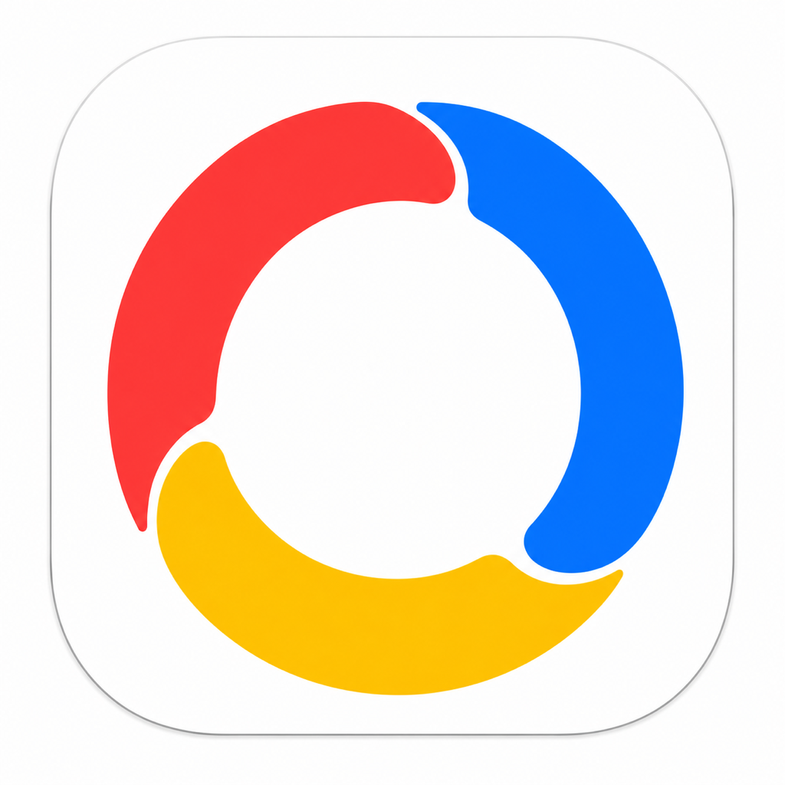

<p align="center">
  
</p>

<h1 align="center">Governor</h1>

<p align="center">
  根据用户空闲时间与最近 15 秒平均 CPU 使用率，自动切换 macOS 电源模式的菜单栏工具。
</p>

<p align="center"><strong>v0.2.2 · settings accessibility · build 6</strong></p>

> [!IMPORTANT]
> 由 `script/package_test_release.sh` 生成的 v0.2.2 资产明确标记为 `UNNOTARIZED`，可在逐个核验来源与 SHA-256 后手动安装。它们使用 ad-hoc 签名、未经 Apple 公证，不是 Developer ID 签名或受信任发行包，macOS 首次直接打开时会被 Gatekeeper 阻止。Apple 要求含 `SMAppService` LaunchDaemon 的 app 必须经过公证；因此这些手动安装资产不能注册持久 root Helper。build 6 保留每个 Governor 进程首次启用自动切换时请求一次管理员授权的桥接；关闭应用后授权失效，也不会出现在“登录项”。

## 功能

- 在 Low Power、Automatic 与 High Power 之间自动选择可用模式。
- 以最近 15 秒平均 CPU 使用率作为负载依据，不使用瞬时值。
- 用户长时间无操作且负载不高时进入 Low Power；恢复操作后立即重新评估。
- High Power 不可用时自动回退到 Automatic，不按机型名称猜测能力。
- 可选择在进入 Low Power 前保存内建屏幕亮度，退出后按设定等待时间恢复。
- 活跃和空闲状态使用独立检测间隔，默认单位均为秒；活跃时可选毫秒、秒或分钟，空闲时可选毫秒或秒。
- 设置窗口可选择 `English` 或 `中文`。首次启动默认英文；检测到系统首选语言为中文时，首次默认中文。用户手动选择后会保存，不会因之后的系统语言变化而被覆盖。
- 可在设置窗口一键恢复规则与选项的默认值，且不改变当前自动化开关状态。
- 检测到用户在系统设置或其他软件中手动更改模式时，可按设置选择是否暂停自动控制。
- 关闭自动化或正常退出时，在安全条件满足后恢复接管前模式。
- 免费手动安装版在每个 Governor 进程首次启用自动切换时请求一次管理员授权；成功后本次运行中的自动切换无需重复输入密码，关闭 Governor 后失效。
- 正式公证版首次启用时通过 `SMAppService` 登记内建 root Helper；管理员在“登录项”中批准一次后，锁屏解锁、退出重开应用和后续启用均不会再次索要管理员密码。

## 首版规则

| 场景 | 结果 |
|---|---|
| CPU 大于 60% | High Power；当前环境不支持时使用 Automatic |
| CPU 不高于 60%，达到设定空闲时间 | Low Power |
| CPU 不高于 60%，用户仍在操作 | Automatic |
| 用户手动修改系统模式 | 默认继续自动化；开启“手动切换后暂停自动化”时暂停并等待用户点击“恢复自动” |
| 权限、读取或切换失败 | 停止继续写入并在菜单栏显示原因 |

默认连续无操作时间为 5 分钟。活跃时默认每 5 秒检测，空闲时默认每 1 秒检测；检测间隔范围为 100 毫秒至 3600 秒。亮度恢复默认开启、等待时间默认 0 毫秒，可输入 0–1000 毫秒。

## 系统要求

- macOS 13 或更高版本
- 支持系统 `pmset` 电源模式接口的 Mac（High Power 是否可用由系统实时检测）
- Swift 6.2 或更高版本（从源码构建时）
- 免费手动安装版启用自动切换时需要本机管理员账号；每次重新打开 Governor 后需再次授权
- 要启用持久 root Helper，必须使用 Developer ID 签名并经 Apple 公证的 app；管理员只需在首次登记时于“登录项”批准一次

## 从源码构建

Governor 是 Swift Package Manager 管理的 SwiftUI 菜单栏应用。运行统一脚本会停止旧进程、构建、生成 `dist/Governor.app`、应用 ad-hoc 开发签名并启动；该本地应用包不适合上传或分发：

```bash
./script/build_and_run.sh
```

只构建并验证本地开发应用包：

```bash
./script/build_and_run.sh --bundle-only
```

构建后启动并确认进程与签名：

```bash
./script/build_and_run.sh --verify
```

调试与日志模式：

```bash
./script/build_and_run.sh --debug
./script/build_and_run.sh --logs
./script/build_and_run.sh --telemetry
```

为保证旧版本用户的偏好与应用容器能随升级保留，生成包的 bundle ID 继续使用 `com.ella.MacPower`；所有可见应用名、二进制名和发布资产名称均为 Governor。

从 MacPower 升级时，先退出旧应用并将 `/Applications/MacPower.app` 移到废纸篓，再安装 `Governor.app`；不要让两个应用同时保留或运行。Governor 会继续读取原有偏好。

## 测试

```bash
./script/run_tests.sh
```

测试覆盖决策边界、15 秒 CPU 窗口、手动修改后的可选暂停、失败停止、模式与亮度恢复、并发切换保护、语言持久化、`SMAppService` 首次登记状态机，以及 root Helper 的全部 `pmset` 许可表。系统依赖在测试中由 test doubles 替代；测试没有请求真实管理员授权、让本机睡眠、重启、关机、注销或断网，也没有注册或启动真实 root Helper。发行脚本会验证 daemon 的受签名 bundle 布局、DMG/ZIP 解压与挂载、签名和 SHA-256。

## 免费手动安装包（UNNOTARIZED）

没有 Apple Developer Program 会员资格时，可生成明确标记为 `UNNOTARIZED` 的拖动安装 DMG 和备用 ZIP：

```bash
./script/package_test_release.sh
```

脚本以 Release 配置构建并应用 ad-hoc 签名，确认 Gatekeeper 不会误把它当作受信任发行版；DMG 内含 `Governor.app`、指向 `/Applications` 的拖动安装快捷方式和安全提示。首次启用自动切换时，macOS 会请求管理员授权；授权只在当前 Governor 进程中保留，退出后必须再次授权。当前 Apple Silicon 机器上的示例输出为：

- `release/Governor-v0.2.2-UNNOTARIZED-macOS-arm64.dmg`
- `release/Governor-v0.2.2-UNNOTARIZED-macOS-arm64.dmg.sha256`
- `release/Governor-v0.2.2-UNNOTARIZED-macOS.zip`
- `release/Governor-v0.2.2-UNNOTARIZED-macOS.zip.sha256`

下载方应先核对 SHA-256，再打开 DMG，把 `Governor.app` 拖到 `Applications`。首次打开会被 macOS 阻止；只有确认下载来源和校验值可信时，才可在“系统设置 → 隐私与安全性”中选择“仍要打开”。这项手动放行只是在当前 Mac 上增加例外，不能替代 Developer ID 签名或 Apple 公证。

把 DMG、ZIP 和对应的 `.sha256` 文件放在同一目录后运行：

```bash
cd release
shasum -a 256 -c Governor-v0.2.2-UNNOTARIZED-macOS-arm64.dmg.sha256
shasum -a 256 -c Governor-v0.2.2-UNNOTARIZED-macOS.zip.sha256
```

SHA-256 只用于发现传输损坏或文件变化，不能证明发布者身份。`UNNOTARIZED` 手动安装包不得被描述为“已签名”“已公证”“Developer ID 可信”“受 Gatekeeper 信任”或“可登记特权 Helper”的正式发行版。该会话授权桥接依赖 Apple 已弃用的 API，未来 macOS 版本可能移除它；不要用终端移除 quarantine 属性或全局关闭 Gatekeeper，只在已核对来源与 SHA-256 后，通过系统设置为这一个 app 创建“仍要打开”例外。

## 正式 Helper 发行的维护者签名与公证流程

`script/package_release.sh` 是 v0.2.2 持久 Helper 的必需流程，而不是可选的美化步骤。只有 Developer ID 签名、Apple 公证、装订和 Gatekeeper 验证全部通过后，`SMAppService` 才能登记 root daemon；应用仍可免费分发，但维护者必须具备这些 Apple 凭据。它不是对 `UNNOTARIZED` GitHub 资产的信任声明。

```bash
export GOVERNOR_SIGNING_IDENTITY='Developer ID Application: Your Name (TEAMID)'
export GOVERNOR_EXPECTED_TEAM_ID='TEAMID'
export GOVERNOR_NOTARY_PROFILE='governor-notary'
./script/package_release.sh
```

该可选流程会构建、核对 Team ID、提交公证、装订票据并运行 Gatekeeper 评估，随后生成：

- `release/Governor-v0.2.2-macOS.zip`
- `release/Governor-v0.2.2-macOS.zip.sha256`

SHA-256 文件只用于传输完整性检查，不能证明发布者身份。详细的维护者流程见 [RELEASING.md](RELEASING.md)。

## 权限与安全边界

Governor 的 app 侧只做固定的只读 `pmset -g` 查询。免费手动安装版在用户明确启用自动切换后，使用会话级管理员授权桥接执行固定路径 `/usr/bin/pmset` 的枚举许可表；它不接受 shell、可执行路径、环境、任意命令或参数，且进程结束时销毁授权。该兼容路径使用 Apple 已弃用的 API，只能作为明确标记的手动安装方案。

Developer ID 签名且已公证的正式版则只能经过 `SMAppService` 注册的 root Helper 写入。Helper 仅暴露一个 XPC 方法，输入为电源来源、模式和控制样式的三个整数枚举；它自行生成固定许可表、清空子进程环境、没有 shell、路径、环境、命令或任意参数入口；请求和回复均使用 `NSSecureCoding` 白名单。

启用亮度恢复时，该功能仅作用于系统内建屏幕，并在本机进程内动态解析 macOS 的 `DisplayServices` 亮度接口；它不需要管理员权限。该接口不可用或显示器不支持时会安全跳过，不影响电源模式切换。

正式版 app 与 Helper 在 XPC 双向使用代码签名要求：daemon 只接受指定 app identifier 与 Team ID 的连接，app 只连接指定 Helper identifier 与 Team ID 的 Mach service。首次明确启用时若 daemon 未登记，app 只调用一次 `SMAppService.register()`；需要批准时停止自动化并提供“打开登录项设置”，绝不会在计时器、失败重试、锁屏解锁或应用重开时再次请求管理员密码。

## 已知限制

- 仅支持 macOS 13 及以上版本。
- 从源码构建的 `dist/Governor.app`、免费手动安装 DMG 和 ZIP 都是 ad-hoc 包，未经 Apple 公证，需要用户手动允许首次打开；它们不能登记 `SMAppService` root Helper，但可以在每个进程首次启用自动切换时请求管理员授权。
- High Power 只在系统实际报告支持时可选。
- 亮度恢复目前只覆盖内建屏幕；外接显示器的 DDC/CI 亮度不在首版范围内。
- 首版没有电池百分比规则、按应用规则、定时计划、通知、学习功能或高级诊断界面。
- 菜单栏应用使用 `.accessory` 激活策略，不显示 Dock 图标或主窗口。

## 项目结构

```text
Sources/Governor/       菜单栏应用、系统服务与界面
Sources/GovernorCore/   可测试的自动化决策与协调逻辑
Sources/GovernorHelperSupport/  XPC 合同与 root pmset 许可表
Sources/GovernorPowerHelper/    仅执行固定许可表的 root XPC daemon
Tests/                  核心与服务测试
Resources/              应用图标
script/                 构建、测试与发布打包脚本
VERSION                 版本、构建号和发布标签
RELEASING.md            手动安装包与可选公证流程
```

## 版本

- 当前版本：`0.2.2`（build `6`）
- 发布标签：`v0.2.2`
- 版本名称：**Settings accessibility**

## 开源许可

本项目按 [MIT License](LICENSE) 开源。
